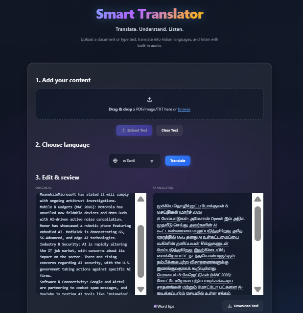

# Smart Translator

Smart Translator is a full‑stack AI translation and document understanding app built for Indian languages. Upload a PDF or image (OCR), paste text, translate instantly, generate an AI summary, ask questions about the document, and listen to results with text‑to‑speech — with user accounts and translation history.

## Screenshots




## Features

- **PDF / Image / TXT ingestion**: Extract text from PDFs (PyMuPDF), images (OCR), or plain text files
- **Instant translation**: Translate into Indian languages (Hindi/Tamil/Bengali/Gujarati/Telugu)
- **Word tooltips**: Hover over translated words to see quick meanings (token-level translation)
- **Text-to-speech**: Generate and play audio with play/pause/resume controls
- **AI summary (Gemini + fallback)**: Produce a concise summary of the translated document (still works when AI is unavailable)
- **Ask AI (Document Q&A)**: Ask questions grounded in the uploaded document and get answers in the selected language
- **Mic input (where supported)**: Dictate questions using the browser Web Speech API
- **History + deletion**: Authenticated history per user with per-item delete and clear-all
- **Modern UX**: Responsive UI with toast notifications

## What You Can Do (Typical Flow)

1. Sign up / log in
2. Upload a PDF/image or paste text
3. Translate to your chosen language
4. Optionally: enable word tooltips, generate an AI summary, ask questions (type or mic), and listen via TTS
5. Save and manage translations in History

## Technology Stack

**Frontend**
- React 18 with Vite
- React Router for navigation
- Axios for API communication
- Custom CSS with theme variables

**Backend**
- Node.js with Express
- MongoDB with Mongoose
- JWT authentication with bcrypt
- Multer for file uploads
- Google Translate API integration

**Python Services**
- EasyOCR for optical character recognition
- PyMuPDF for PDF text extraction

## Prerequisites

- Node.js 18+ or 20+
- Python 3.x with pip
- MongoDB (local or Atlas)

## Installation

### 1. Clone Repository

```bash
git clone https://github.com/Gokila-S/smart-translate.git
cd smart-translate
```

### 2. Server Setup

```bash
cd server
npm install
pip install -r requirements.txt

# Configure environment variables
cp .env.example .env
# Edit .env with your MongoDB URI and JWT secret
```

### 3. Client Setup

```bash
cd client
npm install
```

## Running the Application

Start the server (port 5000):
```bash
cd server
npm run dev
```

Start the client (port 5173):
```bash
cd client
npm run dev
```

Access the application at `http://localhost:5173`

Tip: AI features require `GEMINI_API_KEY`. If it’s missing or rate-limited, the app falls back gracefully where possible.

## API Endpoints

### Authentication
- `POST /api/auth/register` - User registration
- `POST /api/auth/login` - User login

### Translation
- `POST /upload` - Upload and extract text from documents
- `POST /translate` - Translate text
- `POST /summarize` - AI summarization for a document
- `POST /ask` - Ask questions about a document (AI Q&A)
- `POST /tts` - Generate text-to-speech audio
- `POST /translateTokens` - Get word-level translations

### History
- `GET /api/history` - Retrieve translation history
- `POST /api/history` - Save translation
- `DELETE /api/history/:id` - Delete single entry
- `DELETE /api/history` - Clear all history

## Project Structure

```
smart-translate/
├── client/              # React frontend
│   ├── src/
│   │   ├── components/
│   │   ├── context/
│   │   ├── pages/
│   │   └── utils/
│   └── package.json
├── server/              # Node.js backend
│   ├── models/
│   ├── routes/
│   ├── ocr.py
│   ├── pdf_reader.py
│   ├── summarizer.py
│   ├── server.js
│   └── package.json
└── docs/                # Documentation assets
```

## Environment Variables

Configure the following in `server/.env`:

```env
MONGO_URI=mongodb://127.0.0.1:27017/smart-translator
JWT_SECRET=your-secure-secret-key
GEMINI_API_KEY=your-gemini-api-key
GEMINI_MODEL=gemini-flash-latest
PORT=5000
TRANSLATE_API_URL=https://translate.googleapis.com/translate_a/single
```

Note: Do not commit `server/.env` to GitHub. For remote deployment (Render/Railway/etc.), set these variables in the provider dashboard.

## Contributing

Contributions are welcome. Please submit pull requests to the main repository.
