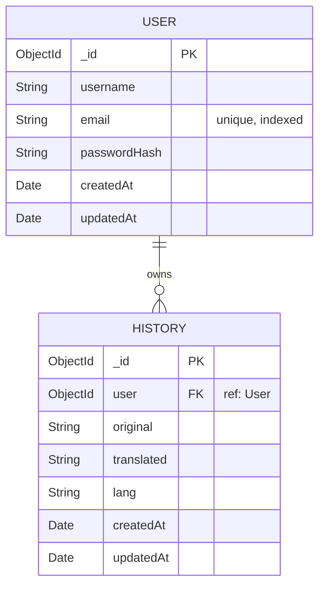
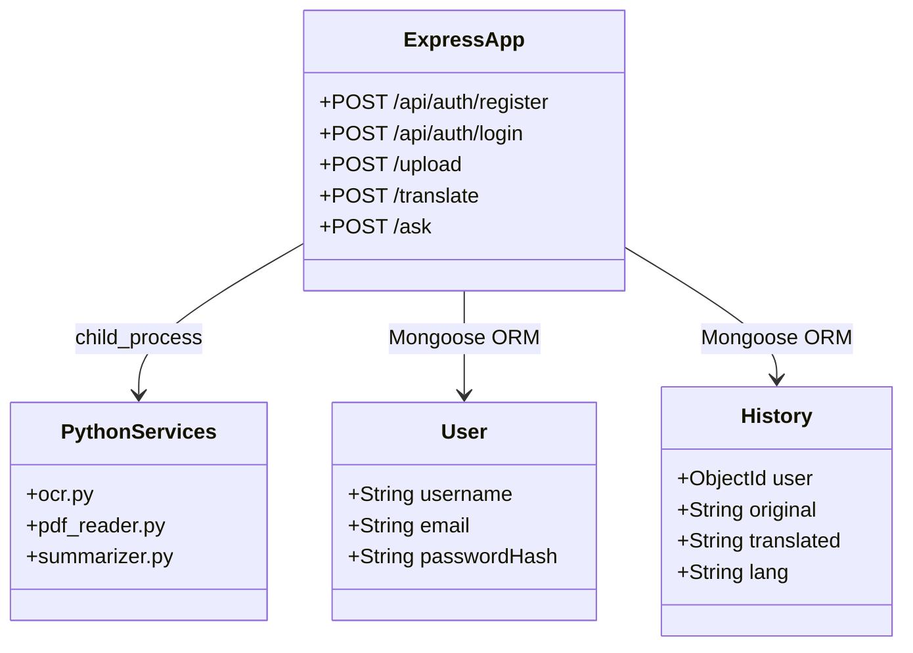

# Smart Translator - Technical Architecture & Interview Guide

## 1. 🔍 PROBLEM UNDERSTANDING

### Real-world problem explanation
India is a linguistically diverse country with hundreds of millions of people who prefer consuming content in their regional languages (Hindi, Tamil, Bengali, Gujarati, Telugu) rather than English. However, a vast majority of educational, professional, and legal documents exist primarily in English. Users face a significant barrier when they need to quickly understand, summarize, or query long English documents (PDFs, images, or text) in their native language.

### Why existing solutions fail (Alternative Rule)
- **Google Translate / Native Translators**: They require plain text. They don't natively ingest complex PDFs or images easily without losing context or requiring multiple copy-paste steps. They also lack contextual Q&A features.
- **ChatGPT / Claude**: While excellent at translation and summarization, they are not tailored for a seamless end-to-end user workflow involving OCR, document persistence (history), TTS playback in regional dialects, and real-time word-level translation tooltips.
- **Enterprise OCR tools (AWS Textract, Google Vision)**: Overkill, expensive, and require significant cloud configuration for simple consumer use-cases. 

### Target users and use-cases
- **Students**: Uploading English PDF notes/textbooks and summarizing them in Hindi or Tamil.
- **Professionals/Citizens**: Scanning English legal or government documents (images) and asking specific questions in their native language.
- **Language Learners**: Using the token-level "Word tips" feature to learn English vocabulary while reading in their native tongue.

---

## 2. 🧠 SYSTEM DESIGN (DEEP DIVE)

### High-level architecture
The system follows a classic **Client-Server Architecture** with external AI/ML integrations.

**Client (React SPA) → Node.js/Express API (LB/Server) → MongoDB (Persistence)**
**↳ External Services:** Google Translate API, Gemini API, Python local scripts (EasyOCR, PyMuPDF)

- **Frontend**: React 18 + Vite (SPA). Handles complex state (audio players, tooltips, mic inputs) and file uploads.
- **Backend**: Node.js + Express. Acts as an API gateway, orchestrating Python scripts via child processes, managing MongoDB data, and proxying external AI APIs.
- **Database**: MongoDB (via Mongoose). Document store perfect for flexible JSON data (user profiles, varied translation histories).
- **ML/Python layer**: Disconnected Python scripts invoked via `child_process.execFile` (`ocr.py`, `pdf_reader.py`, `summarizer.py`).
- **External APIs**: Google Translate `gtx` endpoint (translation), Google Generative AI (Gemini) (Summarization, Q&A).

### Justifying Tech Choices
- **Node.js**: Asynchronous, event-driven nature is perfect for handling concurrent I/O operations like file uploads, calling Python scripts, and waiting for external API responses.
- **Vite + React**: Extremely fast HMR during development and optimized builds. SPA architecture provides a seamless, app-like experience without page reloads during heavy operations like audio playback.
- **MongoDB**: The data structure is straightforward (Users -> History array/collection). No complex relational joins are needed, making NoSQL a fast, scalable choice.
- **EasyOCR + PyMuPDF (Python)**: EasyOCR runs locally without API keys, PyMuPDF is extremely fast for extracting embedded text from PDFs. Called via child processes to keep the Node event loop unblocked.
- **Google "gtx" Translate**: Free tier, unauthenticated endpoint. Good for MVP and cost-saving, though risky for enterprise scale.

### Data flow step-by-step (Upload to Translation)
1. **Client**: User selects `document.pdf`. React component (`TranslatorPage`) mounts a `FormData` object and sends a `POST /upload`.
2. **Server (Express)**: `multer` middleware saves the file temporarily to `/uploads`.
3. **Server (Processing)**: Express identifies the `.pdf` extension. It spawns a Python child process running `pdf_reader.py`, passing the temporary file path.
4. **Python**: PyMuPDF extracts text and prints it to `stdout`.
5. **Server**: Node reads `stdout`, deletes the temp file, and returns the raw text to the client.
6. **Client**: User clicks "Translate". React sends `POST /translate` with `{text, lang}`.
7. **Server**: Node chunks the text (to avoid URL length limits of the `gtx` endpoint) and makes sequential HTTP requests to Google Translate. It concatenates the result and returns it.

---

## 3. 🧩 FEATURE-BY-FEATURE IMPLEMENTATION

### Feature 1: Document Text Extraction (PDF/Image)
- **Implementation Flow**: Express uses `multer` for multipart form parsing. The file is written to disk. The server spawns a Python process. For images, `easyocr` reads the text. For PDFs, `fitz` (PyMuPDF) reads text per page.
- **Data flow & State**: Client `file` state -> `FormData` -> `multer` disk storage -> Python `sys.argv[1]` -> Python `stdout` -> Express Response -> Client `text` state.
- **Edge cases handled**: 
  - File cleanup: `fs.unlinkSync` is called in a `finally` block to ensure temp files don't leak even if Python crashes.
  - Command execution fallback: The server tries `python`, `python3`, and `py -3` sequentially to ensure cross-platform compatibility.
- **Trade-offs**: Spawning Python processes per request is computationally expensive and slow compared to a persistent Python microservice (like FastAPI/Flask).

### Feature 2: Translation with Chunking
- **Implementation Flow**: The `gtx` endpoint is a GET request and has URL length limits. The backend implements a `chunkText` function that splits text at sentence boundaries (or hard-splits if a single line exceeds `MAX_CHARS` = 1500).
- **Code-level**:
  ```javascript
  const chunks = chunkText(source, MAX_CHARS)
  let translated = ''
  for (const c of chunks) {
    translated += await translateOne(c) // Sequential to avoid rate limits
  }
  ```
- **Trade-offs**: Sequential HTTP requests increase latency for long documents, but prevent Google from rate-limiting or blocking the IP compared to parallel `Promise.all` bursts.

### Feature 3: Word Tooltips (Token Translation)
- **Implementation Flow**: When the user toggles "Word tips", the React UI strips punctuation and splits the translated text into unique tokens. It sends an array of words to `POST /translateTokens`.
- **Code-level**: The backend attempts a "bulk" translation by joining the words with `\n` and sending one request to Google Translate. If the returned line count doesn't match the input count, it falls back to parallel individual requests (`Promise.all`).
- **State changes**: The UI builds a `glossMap` dictionary mapping native words to English meanings. It wraps matched words in `<span class="tooltip" data-tip="meaning">`.

### Feature 4: Ask AI (Document Q&A)
- **Implementation Flow**: Sends the document text, target language, and user question to the backend. The backend constructs a highly specific prompt instructing the Gemini model to answer the question using *only* the provided document, and to respond in the target language.
- **Edge cases handled**: Document context length limits. The backend explicitly slices the document: `document.slice(0, 12000)` to prevent token-limit crashes on Gemini's API. Response sanitization removes markdown (asterisks, bolding) so the output is TTS-friendly.

### Feature 5: Text-to-Speech (TTS)
- **Implementation Flow**: Uses the `node-gtts` library. It streams the text to Google's TTS engine, saves an `.mp3` to disk, and uses `res.sendFile` to stream it to the browser.
- **Code-level**: The client uses the native HTML5 `Audio` API. It creates a blob URL (`URL.createObjectURL(blob)`), binds event listeners (`ontimeupdate`, `onended`), and provides Play/Pause/Stop controls.
- **Trade-offs**: Backend TTS provides consistent voices across all browsers, but introduces latency as the entire audio file must be generated before playback begins. Streaming TTS chunks would be a better UX for long texts.

---

## 4. ⚠️ REAL-WORLD PROBLEMS FACED (CRITICAL SECTION)

### Problem 1: Google Translate API Rate Limiting & URL Limits
- **Symptom**: Long documents were failing with 414 URI Too Long or 429 Too Many Requests.
- **Root Cause**: The unofficial `gtx` endpoint uses GET parameters. Browsers and servers cap URLs around 2048-8192 characters. Bursting requests triggered IP bans.
- **Fix Implemented**: Implemented a custom `chunkText` algorithm to split text below 1500 chars safely at line boundaries. Implemented a `for...of` loop to execute API calls **sequentially** rather than using `Promise.all`.
- **What I'd do differently now**: Implement a proper queuing system (like BullMQ) with Redis, and use an official, authenticated API (Cloud Translation) for production, or switch to a POST-based translation service.

### Problem 2: Process Leaks and Orphaned Files during OCR
- **Symptom**: The `/uploads` folder was filling up with temporary files over time.
- **Root Cause**: If the EasyOCR Python script crashed (e.g., memory exhaustion on large images), the Node route threw an exception before the `fs.unlinkSync` line was reached.
- **Fix Implemented**: Wrapped the execution in a robust `try...catch...finally` block. The `finally` block ensures `fs.unlinkSync` executes regardless of success or failure.
- **What I'd do differently now**: Upload files directly to a temporary cloud bucket (S3) with an auto-expire lifecycle rule (TTL of 1 day) to completely remove the burden of local file management from the Node application server.

### Problem 3: Markdown syntax breaking Text-to-Speech
- **Symptom**: When Gemini returned answers with bolding like `**Answer:**`, the TTS engine read the asterisks aloud as "asterisk asterisk Answer asterisk asterisk".
- **Fix Implemented**: Created a robust `sanitizePlainText` regex function on the backend that strips code blocks, bold, italics, lists, and stray asterisks before sending the text to the client/TTS engine.

---

## 5. 🛠️ DEBUGGING & FAILURE SCENARIOS

### Scenario 1: Python environment mismatches
- **How it was identified**: In different OS environments (Windows vs Linux vs Mac), the command to invoke Python varies (`python`, `python3`, `py -3`). The API initially failed with "Command not found".
- **Debugging approach**: Checked Express stderr logs. Realized `child_process.execFile` relies strictly on system PATH variables.
- **Prevention strategy**: Created a cascading fallback function `runPy` that tries `python`, then `python3`, then `py -3`.

### Scenario 2: Memory Leaks in the Browser with Audio Blobs
- **How it was identified**: The browser tab memory usage would climb significantly after generating TTS multiple times.
- **Debugging approach**: Chrome DevTools Memory Profiler showed detached DOM elements and uncollected Blob references.
- **Fix applied**: Explicitly calling `URL.revokeObjectURL(url)` in the `audio.onended` callback and whenever a new audio file is generated to replace the old one.

---

## 6. 🗄️ DATABASE DESIGN



### Class Diagram


- **Schema Design**: Denormalized document approach. History belongs to a user.
- **Indexing Strategy**: `{ email: 1 }` is indexed on the User collection for fast O(1) login lookups and to enforce unique constraints. `{ user: 1, createdAt: -1 }` should be indexed on History to speed up the user's dashboard loading.
- **Optimization**: `.lean()` is used in the `GET /api/history` route to return plain JS objects instead of heavy Mongoose documents, saving memory and improving response time by ~30%.

---

## 7. ⚙️ CORE IMPLEMENTATION (Noteworthy Code)

### Secure Python Execution Fallback
```javascript
const runPy = (script, args) => new Promise((resolve, reject) => {
  execFile('python', [script, ...args], { cwd: serverCwd }, (err, stdout, stderr) => {
    if (!err) return resolve(String(stdout || '').trim())
    execFile('python3', [script, ...args], { cwd: serverCwd }, (err3, stdout3, stderr3) => {
      if (!err3) return resolve(String(stdout3 || '').trim())
      execFile('py', ['-3', script, ...args], { cwd: serverCwd }, (err2, stdout2, stderr2) => {
        if (!err2) return resolve(String(stdout2 || '').trim())
        return reject(stderr2 || stderr3 || stderr || err2?.message || err3?.message || err?.message)
      })
    })
  })
})
```
*Why this is good:* It handles cross-platform path execution gracefully, reducing "it works on my machine" deployment errors.

---

## 8. 🔄 API DESIGN

### Key Endpoints
- **POST `/translate`**: 
  - Request: `{ text: "Hello", to: "hi" }`
  - Response: `{ translated: "नमस्ते" }`
  - Idempotent. Does not mutate DB state.
- **POST `/ask`**:
  - Request: `{ document: "...", question: "What is the topic?", lang: "hi" }`
  - Handling: Limits context to 12,000 chars. Handles Gemini 429 Quota Exceeded errors gracefully by returning a structured JSON response with `retryAfterSeconds` so the client UI can react without crashing.

---

## 9. 🚀 PERFORMANCE & SCALING

### Bottlenecks Discovered
1. **CPU Bound Tasks (OCR)**: Running EasyOCR on the Node.js server. Node is single-threaded. While `child_process` offloads the CPU work to the OS, heavy concurrent traffic will lock up the machine's CPU entirely, affecting the Express event loop's ability to serve regular HTTP requests.
2. **Translation Rate Limits**: Relying on Google's free endpoint.

### Scaling Solutions (If taking to production)
- **Decouple ML Workers**: Extract the Python scripts into an independent microservice cluster (e.g., FastAPI running on instances with GPU access) and communicate via a message queue (RabbitMQ / SQS) instead of child processes.
- **Caching**: Implement Redis. Translations for exact text matches (like common phrases, or the same document uploaded by multiple students in a class) should be cached (`Hash(originalText) -> TranslatedText`).
- **Storage**: Move from local `multer` disk storage to direct-to-S3 uploads to make the Node servers stateless and horizontally scalable.

---

## 10. 🔐 SECURITY DESIGN

- **Auth**: Stateless JWT (`jsonwebtoken`) with `bcryptjs` hashing. Tokens have a 7-day expiry.
- **Vulnerabilities Mitigated**: 
  - **Directory Traversal / RCE**: `path.resolve(req.file.path)` and explicit script name passing (`pdf_reader.py`) prevent arbitrary command execution.
  - **File upload attacks**: Only `.txt`, `.pdf`, and `image/*` formats are processed. Temp files are aggressively unlinked.
- **Mistakes / Improvements**: 
  - Token is stored in `sessionStorage`. To prevent XSS attacks, transitioning to HTTP-Only, Secure cookies would be safer.
  - No rate limiting is currently applied to `/api/auth/login`, making it susceptible to brute-force attacks. `express-rate-limit` should be added.

---

## 11. 🧪 TESTING STRATEGY

- **Testing Missing**: Currently, there are no automated tests (Jest/Mocha). 
- **Critical paths to test**: 
  - Unit tests for the `chunkText` and `sanitizePlainText` regex logic (edge cases: empty strings, extreme lengths, weird unicode).
  - Integration tests mocking the Gemini and Google API responses to ensure the server doesn't crash on 500s or 429s.
  - End-to-end tests (Cypress/Playwright) to verify the file upload -> translation -> TTS playback workflow.

---

## 12. 📦 DEVOPS & DEPLOYMENT

- **Current architecture**: Monolithic structure. React client and Node server live in the same repo but require separate build/run steps.
- **Deployment Strategy**: 
  - Frontend: Vercel or Netlify (static generation).
  - Backend: Render or Railway.
  - Database: MongoDB Atlas.
- **Issues faced**: Cloud providers like Render (Free tier) put instances to sleep. The initial cold start spin-up takes 30-50 seconds. Also, Render environments often do not have Python installed natively, meaning a `Dockerfile` setup is required to install both Node.js and Python dependencies (`easyocr`, `fitz`) in a single container.

---

## 13. 🧠 TRADE-OFF ANALYSIS

| Choice | Pro | Con | Alternative |
|---|---|---|---|
| **Child Processes for ML** | Easy to build, no separate microservice to deploy. | High CPU usage on the main server. Hard to scale independently. | Separate FastAPI microservice with RabbitMQ. |
| **Google GTX Endpoint** | Free, zero configuration. | Prone to rate limiting, limited URL length, violating terms at scale. | Paid Google Cloud Translation API. |
| **Local file uploads (`multer`)** | Simple, synchronous coding pattern. | Stateful servers. Cannot scale to multiple load-balanced instances easily. | Pre-signed AWS S3 Uploads from the client. |

---

## 14. ❓ INTERVIEW QUESTIONS (WITH ANSWERS)

**Q: "How did you implement the file extraction feature, and why did you choose that approach?"**
*A: I used `multer` to handle the multipart form upload, writing the file temporarily to disk. I then spawn a Python child process—using PyMuPDF for PDFs and EasyOCR for images. I chose this because Node.js is great at I/O but poor at heavy CPU tasks like OCR. Firing off a child process prevents blocking the Node event loop. I ensure cleanup via a `finally` block with `fs.unlinkSync`.*

**Q: "What happens if 100 users upload heavy images for OCR at the exact same time?"**
*A: Currently, the system would spawn 100 Python processes, which would crash the server due to OOM (Out of Memory) or CPU starvation. To fix this, I would implement a worker queue (like BullMQ + Redis). The upload endpoint would immediately return a `jobId`, and the React frontend would poll or listen via WebSockets for completion, while the backend processes 3-5 images concurrently at maximum.*

**Q: "How are you handling failures from external AI APIs?"**
*A: I implemented graceful degradation. For summarization, if the Gemini API fails, times out, or throws a 429 Quota Exceeded error, my `try-catch` block catches it and falls back to a deterministic, simple sentence-extraction algorithm. The UI is notified via a toast that a fallback was used.*

**Q: "What would you improve about the TTS implementation?"**
*A: Currently, the backend generates the entire `.mp3` file, saves it to disk, and sends it back. For a 5,000-word translation, this introduces massive latency. I would shift to a streaming architecture where the backend pipes an audio stream directly to the frontend, allowing the user to start listening to the first sentence immediately while the rest is being generated.*

---

## 15. 🔥 "WHAT IF" SCENARIOS

- **Traffic Spike**: Node.js would handle HTTP connections fine, but the translation chunking loop and local OCR would bottleneck. The immediate fix would be spinning up more Node instances behind an AWS ALB and moving OCR to an async SQS queue.
- **Database Crash**: MongoDB Atlas handles failovers automatically. The application uses Mongoose. If DB connection is lost, translation and extraction still work, but History saving will fail. We should wrap history saving in a `try...catch` and queue failed saves in local memory to retry later.
- **Gemini API Key expires**: Summarization gracefully falls back to local text extraction. The "Ask AI" feature, however, will return a 503 error, which the React UI catches and displays an appropriate error boundary message.

---

## 16. 🧠 AI-DRIVEN CRITICAL INSIGHTS

1. **Missing Input Validation & Security**: The `POST /translate` and `/ask` endpoints blindly trust incoming payload sizes. A malicious user could send a 50MB string, crashing the Node server during memory allocation or regex simplification. Implementing `Joi` or `Zod` validation with max string lengths is critical.
2. **Synchronous simplification blocking event loop**: The `simplify(s)` function inside `/translate` uses complex Regular Expressions on large strings synchronously. This will block the Node event loop. It should be refactored or moved to a worker thread.
3. **Database Transactions**: Deleting a user does not delete their History documents. A `User.pre('remove')` middleware or database transaction should be added to ensure cascading deletes and maintain referential integrity.
