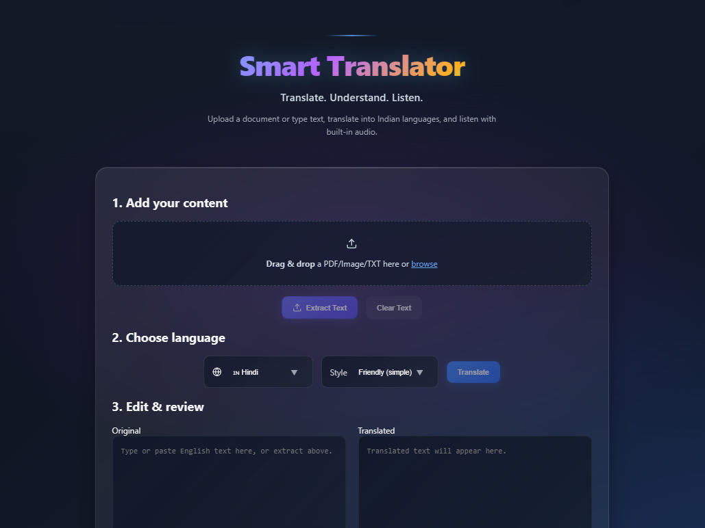

# Smart Translator

A full-stack translation application with OCR, document processing, text-to-speech, and translation history management.



## Features

- **Document Processing**: Upload and extract text from PDF, images, and text files using OCR
- **Translation**: Real-time translation with friendly/formal tone options across 50+ languages
- **Interactive Tooltips**: Hover over translated words to view individual meanings
- **Text-to-Speech**: Audio playback with play, pause, resume controls
- **History Management**: Track translations with user authentication and per-item deletion
- **Responsive Design**: Modern UI with toast notifications and smooth animations

## Technology Stack

**Frontend**
- React 18 with Vite
- React Router for navigation
- Axios for API communication
- Custom CSS with theme variables

**Backend**
- Node.js with Express
- MongoDB with Mongoose
- JWT authentication with bcrypt
- Multer for file uploads
- Google Translate API integration

**Python Services**
- EasyOCR for optical character recognition
- PyMuPDF for PDF text extraction

## Prerequisites

- Node.js 18+ or 20+
- Python 3.x with pip
- MongoDB (local or Atlas)

## Installation

### 1. Clone Repository

```bash
git clone https://github.com/Gokila-S/smart-translate.git
cd smart-translate
```

### 2. Server Setup

```bash
cd server
npm install
pip install -r requirements.txt

# Configure environment variables
cp .env.example .env
# Edit .env with your MongoDB URI and JWT secret
```

### 3. Client Setup

```bash
cd client
npm install
```

## Running the Application

Start the server (port 5000):
```bash
cd server
npm run dev
```

Start the client (port 5173):
```bash
cd client
npm run dev
```

Access the application at `http://localhost:5173`

## API Endpoints

### Authentication
- `POST /api/auth/register` - User registration
- `POST /api/auth/login` - User login

### Translation
- `POST /upload` - Upload and extract text from documents
- `POST /translate` - Translate text with mode selection
- `POST /tts` - Generate text-to-speech audio
- `POST /translateTokens` - Get word-level translations

### History
- `GET /api/history` - Retrieve translation history
- `POST /api/history` - Save translation
- `DELETE /api/history/:id` - Delete single entry
- `DELETE /api/history` - Clear all history

## Project Structure

```
smart-translate/
├── client/              # React frontend
│   ├── src/
│   │   ├── components/
│   │   ├── context/
│   │   ├── pages/
│   │   └── utils/
│   └── package.json
├── server/              # Node.js backend
│   ├── models/
│   ├── routes/
│   ├── ocr.py
│   ├── pdf_reader.py
│   ├── summarizer.py
│   ├── server.js
│   └── package.json
└── docs/                # Documentation assets
```

## Environment Variables

Configure the following in `server/.env`:

```env
MONGO_URI=mongodb://127.0.0.1:27017/smart-translator
JWT_SECRET=your-secure-secret-key
PORT=5000
TRANSLATE_API_URL=https://translate.googleapis.com/translate_a/single
```

## Contributing

Contributions are welcome. Please submit pull requests to the main repository.

## License

MIT License

## Author

**Gokila S**  
GitHub: [@Gokila-S](https://github.com/Gokila-S)
